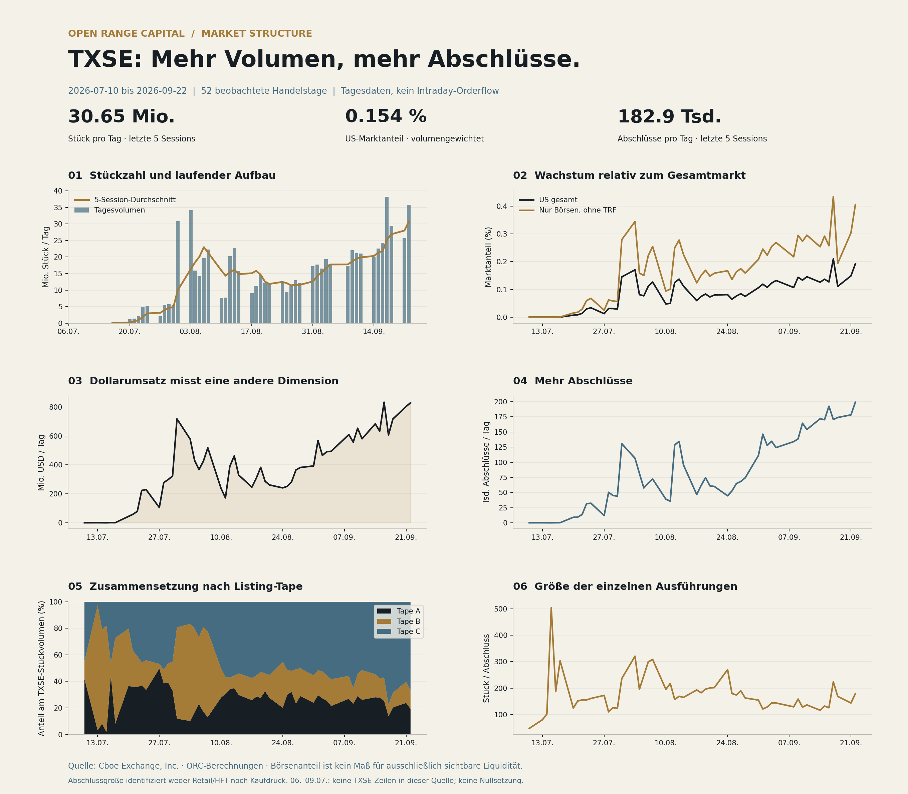

# TXSE | Volume build-up und Trading Behavior

Datenstand: 2026-09-22. News separat mit Recherche-Stichtag. Quelle: Cboe Exchange, Inc.

## Vergleich gleich langer Fenster

| Kennzahl | Vorherige 5 Sessions | Letzte 5 Sessions | Veränderung |
|---|---:|---:|---:|
| Stück / Tag | 21.36 Mio. | 30.65 Mio. | +43.52% |
| USD / Tag | 621.38 Mio. | 757.85 Mio. | +21.96% |
| Abschlüsse / Tag | 159,861.00 | 182,901.40 | +14.41% |
| Stück / Abschluss | 133.60 | 167.59 | +25.44% |
| USD / Stück | 29.10 | 24.72 | -15.02% |
| US-Marktanteil | 0.1369% | 0.1539% | +1.70 bp |

Fenster: 2026-09-09 bis 2026-09-15 und 2026-09-16 bis 2026-09-22. Quotienten werden aus Summen berechnet, nicht als ungewichtete Tagesmittel.

## Aufbau gegenüber der August-Basis

Gegenüber 17.–28.08. (10 Sessions) stieg ADV um 161.4%, Dollarumsatz pro Tag um 151.8% und Abschlüsse pro Tag um 200.3%. Stück je Abschluss veränderten sich von 192.5 auf 167.6. Der gewichtete US-Anteil stieg von 0.0754% auf 0.1539%. Das Wachstum geht damit über einen bloßen Anstieg des gesamten US-Handels hinaus.

## Auffällige Tage und Mixwechsel

| Datum | Stück Mio. | USD Mio. | Abschlüsse | Tape B | Tape C | Stück/Abschluss |
|---|---:|---:|---:|---:|---:|---:|
| 2026-07-31 | 30.87 | 717.54 | 130,636 | 68.8% | 19.3% | 236.3 |
| 2026-08-03 | 34.20 | 577.87 | 106,615 | 73.3% | 16.6% | 320.8 |
| 2026-08-10 | 7.64 | 238.00 | 39,075 | 22.1% | 50.1% | 195.5 |
| 2026-08-12 | 20.20 | 390.23 | 128,494 | 8.7% | 57.2% | 157.2 |
| 2026-09-14 | 20.04 | 683.55 | 171,848 | 17.3% | 54.6% | 116.6 |
| 2026-09-22 | 35.77 | 829.02 | 199,177 | 13.6% | 67.1% | 179.6 |

Die Spitze Ende Juli/Anfang August ist Tape-B-lastig. Tape B ist ein Listing-Universum und kein reiner ETF-Nachweis. Ein niedrigerer aggregierter USD/Stück-Wert und größere Ausführungen erklären, warum Stückzahl allein die wirtschaftliche Größe verzerrt. Einzelne Namen oder Auslöser sind aus diesen Aggregaten nicht bestimmbar.

In den letzten fünf Sessions entfallen 67.2% der Stückzahl auf Tape C. Das ist TXSE-Handel in Nasdaq-gelisteten Wertpapieren, nicht Nasdaqs eigener Ausführungsmarktanteil. Mehr kleinere Ausführungen sind mit stärker fragmentiertem Routing vereinbar; eine Zuordnung zu HFT, Retail oder institutioneller Akkumulation ist damit nicht belegt.

## Statistischer Anomalie-Screen

Robuster z-Wert = 0,67448975 × (Beobachtung − Median der vorangehenden 20 Sessions) / MAD. Der aktuelle Tag ist von der Referenz ausgeschlossen. Schwelle: |z| > 3,5 in mindestens einer der fünf Kennzahlen. Bei weniger als 20 Vorgängern oder MAD=0 bleibt der Wert leer. Das ist ein deskriptiver Screen in einer jungen, nichtstationären Zeitreihe, kein Manipulationsnachweis.

Markierte Tage: 2026-08-07, 2026-09-01, 2026-09-02. Alle Werte stehen in `data/txse_anomalies.csv`.

## Grenzen und nächste Messpunkte

- Keine Orderbuchdaten, Spreads, Stornos, Aggressorseite, Tickerdaten, Intraday-Kurve oder Brokeridentitäten enthalten. Aussagen zu Akkumulation, Spoofing, Wash Trading, HFT-Anteil oder Ausführungsqualität wären unbelegt.
- Der bisherige Feldname `lit_market_share_pct` bedeutet Börsenvolumen ohne FINRA/TRF. Börsenausführungen können nicht angezeigte Liquidität enthalten; die Variable misst keinen reinen Lit-Anteil.
- 06.–09.07. fehlen als TXSE-Beobachtungen in der abgefragten Quelle. Der Abruf beginnt am angekündigten Start 06.07.; die beobachtete Reihe beginnt am 10.07. Fehlende Werte werden nicht auf null gesetzt.
- Laufende Woche und Feiertagswochen nicht über absolute Wochensummen vergleichen. ADV und gleich lange Sessionfenster sind die zentrale Vergleichsbasis.
- Nach Listing-Wechseln: venue capture je Wertpapier, Auktionsanteil, Spread/Tiefe und Persistenz über 5/20 Sessions messen. Ein Listing-Wechsel verschiebt nicht automatisch das gesamte Sekundärmarktvolumen zur TXSE.

## Daten und Reproduzierbarkeit

`data/raw/market_history_2026.csv` enthält das vollständige abgerufene Cboe-Jahresfile einschließlich Nasdaq; Begleit-JSON enthält Abrufzeit und SHA-256. `data/txse_nasdaq_comparison.csv` enthält TXSE und NASDAQ (Q) im Beobachtungsfenster.

[Cboe-Datenbeschreibung](https://www.cboe.com/markets/us/equities/market-statistics/historical-market-volume) · [News und Ereigniskalender](news_2026-09-16.md)

## Größenordnung gegenüber Nasdaq (Q)

NASDAQ (Q) erreicht im gleichen 5-Session-Fenster 3.009 Mrd. Stück und 226.12 Mrd. USD pro Tag. TXSE entspricht 1.02% dieses Stückvolumens und 0.34% dieses Dollarumsatzes. Verglichen wird die einzelne Nasdaq-Börse Q, nicht die gesamte Nasdaq-Gruppe und nicht das Listing-Universum Tape C.
